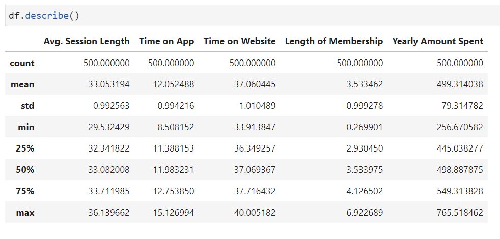
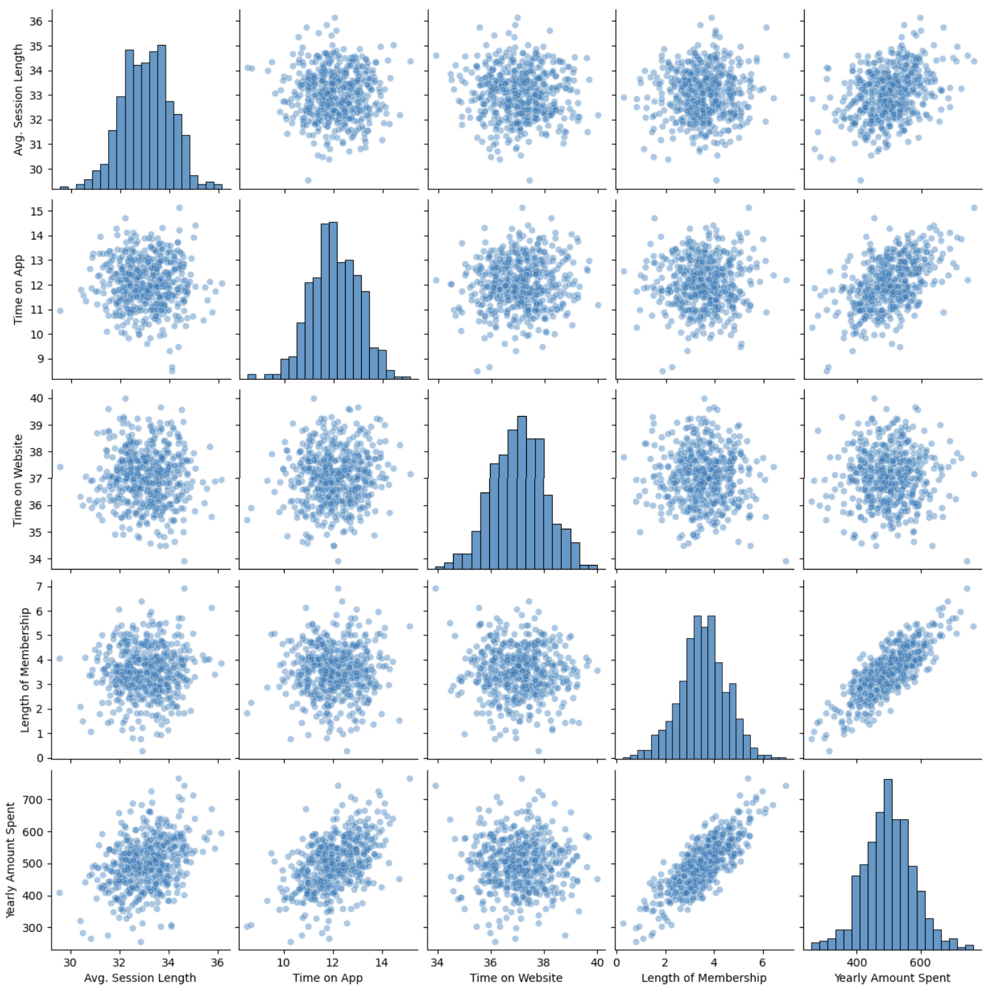
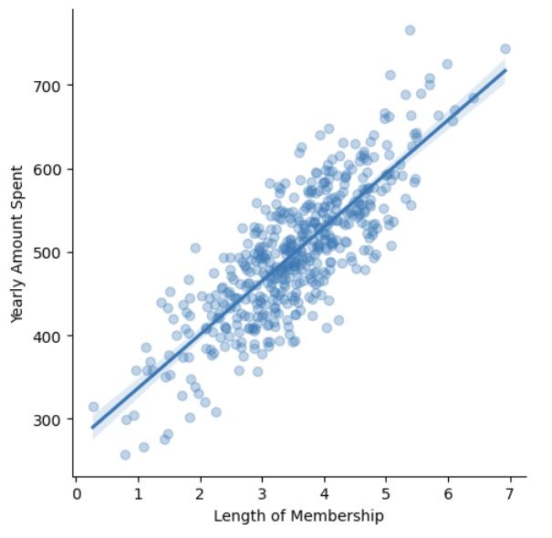
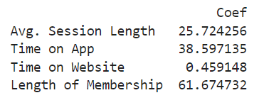
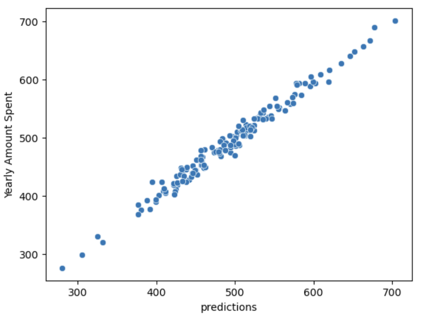
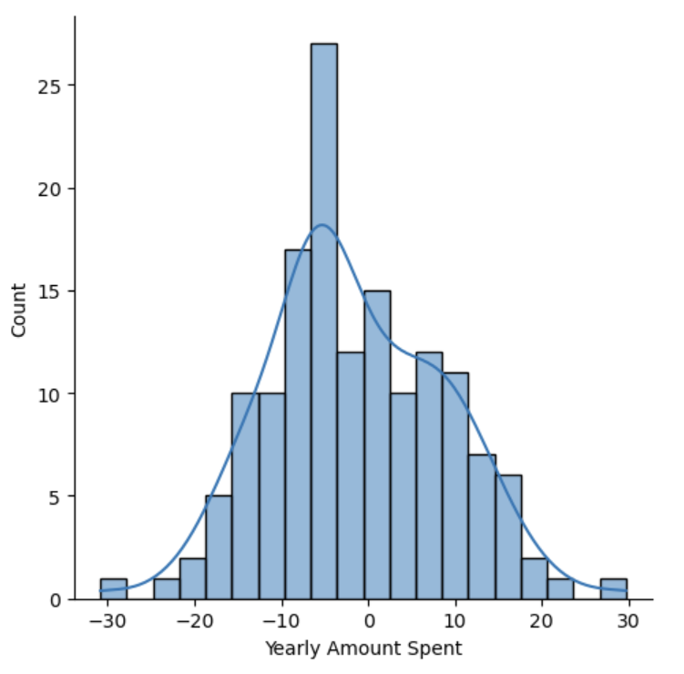
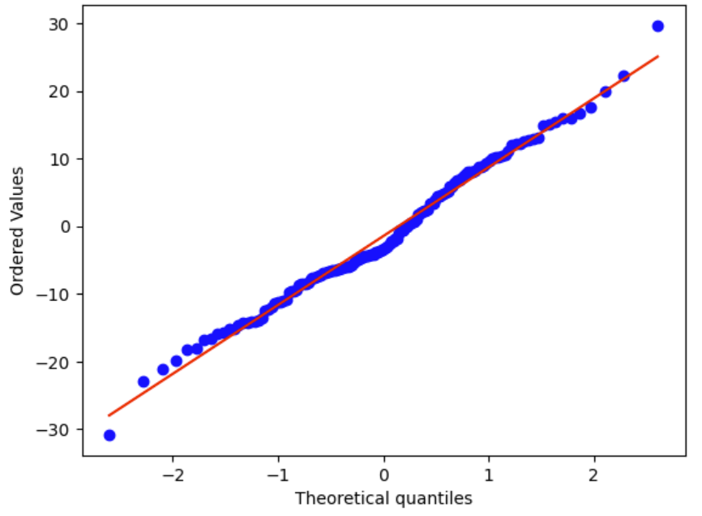

## :chart_with_upwards_trend:Модель линейной регрессии для прогнозирования затрат клиентов в E-commerce продукте

:dart:Цель: разработка модели, предсказывающей расходы клиентов

:memo:Задачи: 
1. определить зависимости в данных
2. разделить данные на обучающую и тестовую выборки
3. обучить модель линейной регрессии
4. рассчитать предикторы
5. оценить достоверность модели

Стек: python, pandas, sklearn, seaborn, pylab, scipy

Исходные данные: датасет содержит данные о клиентах, которые покупают одежду в интернет-магазине. Продукт предлагает консультации по стилю и одежде в магазине. Покупатели приходят в магазин, проводят сеансы/встречи с личным стилистом, затем они могут пойти домой и заказать через мобильное приложение или веб-сайт ту одежду, которую они хотят.

### :white_check_mark: **EDA :**
- всего 500 значений 
- null значения отсутствуют
- 8 столбцов



Функция `describe()` позволяет узнать какие значения принимает каждая переменная, какой диапазон и разброс. Представления о средних значениях позволяют понять, правильно ли создается регрессионная модель и возможно заподозрить какие то ошибки, неточности.

### :white_check_mark: **Исследование зависимости переменных**
Целевым показателем, для которого будет создаваться модель, выбран Yearly Amount Spent. 

При анализе зависимостей этой переменной с другими показателями, обнаружена чёткая зависимость с длительностью использования (Length of Membership).



### :white_check_mark: **График линейной регрессии**
Суть линейной регрессии заключается в том, чтобы найти такую линию, расстояние до которой от каждого значения будет минимальным

Уравнение линейной регрессии: <br>
***Y=a+bx*** <br>
b  - Коэффициент b является наклоном (slope) или угловым коэффициентом. показывает насколько важна переменная <br>

a - Коэффициент a является свободным членом или сдвигом. Он определяет значение Y, когда значение x равно нулю. пересечение с осью y <br>

Коэффициенты и будут влиять на прогноз переменной Yearly Amount Spent.



### :white_check_mark: **Делим данные с помощью Scikit-Learn**
Для обучения модели, данные из датасета нужно разделить на две группы: выборка, на которой будет проходить обучение (train) и выборка, на которой проверяется полученная модель(test). Это позволит проверить хорошо ли она прогнозирует.

```python
    X = df[['Avg. Session Length', 'Time on App', 'Time on Website', 'Length of Membership']] # датасет с предикторами
    y = df['Yearly Amount Spent'] # прогнозируемая переменная

    X_train, X_test, y_train, y_test = train_test_split(X, y, test_size=0.3, random_state=42) 
    # test_size - насколько большая тестовая выборка (0.3 = 30%) 
```


### :white_check_mark: **Обучение модели**

Использован метод `LinearRegression.fit()` из библиотеки Scikit-Learn. Он подстраивает модель линейной регрессии таким образом, чтобы минимизировать сумму квадратов разностей между предсказанными значениями и фактическими значениями целевой переменной. В процессе обучения модель определяет значения коэффициентов (наклонов) для каждого признака, а также свободный член (смещение) для линейного уравнения.

### :white_check_mark: **Интерпретация коэффициентов**

`LinearRegression.coef_` получем все коэффициенты линейной модели.
Их величина отражает вес каждой переменной в модели.

Как видно, наибольшее влияние на изменение Yearly Amount Spent оказывает длительность использования продукта (Length of Membership). В меньшей степени целевой показатель зависит от времени, проведенного в приложении (Time on App) и от средней длительности сессии (Avg. Session Length).



### :white_check_mark: **Получаем предикторы**

В итоге получаем массив с предикторами модели для тестового набора данных (X_test).

### :white_check_mark: **Сверка рассчитанных и эмпирических значений**
На данном графике сравниваются рассчитанные значения (ось X) с эмпирическими (ось Y). В идеале, значения должны совпадать (на графике должна получиться прямая линия). Однако любая модель имеет погрешности. В таком случае, расположение точек должно стремиться к прямой линии. Как видно, точки расположены практически на прямой, что свидетельствует о том, что предикторы посчитаны правильно.



### :white_check_mark: **Оценка ошибок**
При оценке ошибок модели линейной регрессии используются различные метрики, которые позволяют измерить точность предсказаний модели и оценить, насколько она отклоняется от истинных значений.

*Средняя абсолютная ошибка (Mean Absolute Error)* - это среднее отклонений предсказанных значений от истинных. 

Значение **САО равно 8.43 USD**, что означает, что в среднем модель ошибается на 8.43 USD.

*Среднеквадратичная ошибка (Mean Squared Error)* - это среднее значение квадратов отклонений предсказанных величин от истинных. 

Значение **СКО равно 103.92**. СКО учитывает не только величину ошибок, но и их распределение. Взятие квадрата ошибок увеличивает вес больших ошибок и делает модель более чувствительной к выбросам.

*Корень из среднеквадратичной ошибки (Root Mean Squared Error, RMSE)* - это квадратный корень из MSE. 

Значение $\sqrt{СКО}$ **равно 10.19 USD**. Эта метрика обладает тем же свойством, что и СКО, но ее значения имеют ту же шкалу, что и исходные значения, что удобно для интерпретации.

Оценка этих значений при оценке ошибок модели линейной регрессии позволяет оценить точность модели. Чем меньше значения САО, СКО и $\sqrt{СКО}$, тем лучше модель предсказывает данные.

Относительно среднего значения Yearly Amount Spent (499$) ошибка небольшая.

### :white_check_mark: **Анализ остатков**

Распределение остатков близко к нормальному, что обеспечивает их независимость друг от друга. Из чего следует, что выборка случайна и репрезентативна.







### :pushpin: **Заключение**
Далее следует проверить работу модели на новых данных, не использованных в обучении и тестировании. Это может помочь оценить, насколько модель способна обобщать и предсказывать значения для новых наблюдений.

После этого модель считается удовлетворительной и готова к развертыванию на реальных данных.
Однако важно мониторить ее производительность и обновлять при необходимости.
